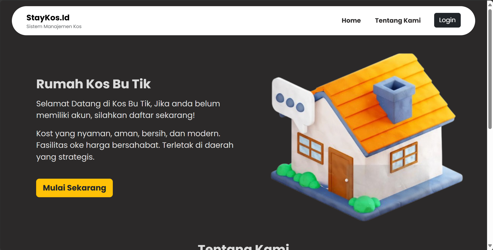
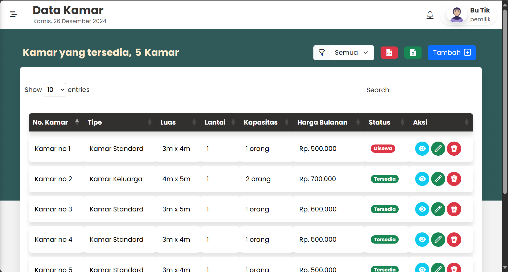
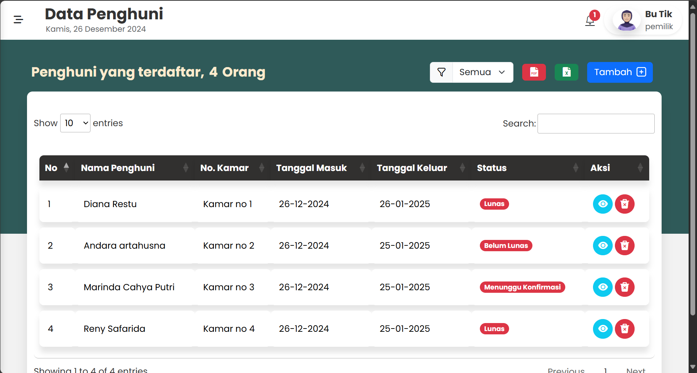
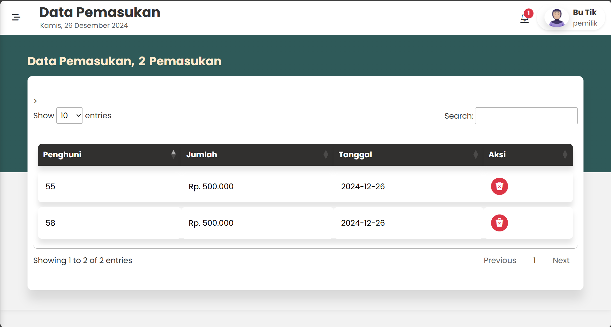
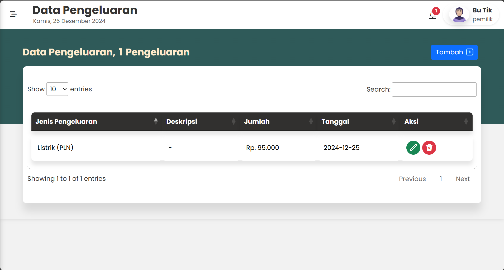

# Projek Kos_Staykost.id
**StayKost.id** merupakan proyek yang dibuat dalam rangka pemenuhan tugas akhir semester mata kuliah Pemrograman Web Lanjut - Program Studi Manajemen Informatika - Kelas 2B. Sistem ini dikembangkan menggunakan framework Laravel untuk memudahkan pemilik dalam mengelola kos.

**Anggota Kelompok :**
1.	Andara Artahusna - 2331730090 
2.	Diana Restu - 2331730018 
3.	Marinda Cahya P - 2331730030 
4.	Reny Safarida - 2331730040

## Manual Book
[Documentation](https://github.com/user53y/PROJEK-KOS/blob/214a9e2e5e0e55aa79ac34a74b834001eecc62df/Manual_book_Manajemen_kost.pdf)

## Priview Pengguna bagian -> Pemilik

**Priview Menu**

**Landing Page**

**Dashboard Pemilik**

**Halaman kelola Kamar**

**Halaman Kelola Penghuni**

**Halaman kelola Pemasukan**

**Halaman kelola Pengeluaran**

**cetak laporan**

## Priview Pengguna bagian -> Penghuni

**Priview Menu**

**Halaman Pesan Kamar**

**Halaman Cek Pembayaran**

