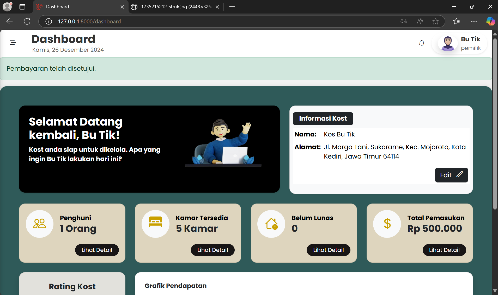

# Projek Kos_Staykos.id
StayKos.id merupakan proyek yang dibuat dalam rangka pemenuhan tugas akhir semester mata kuliah Pemrograman Web Lanjut - Program Studi Manajemen Informatika Kelas 2B. Sistem ini dikembangkan menggunakan framework Laravel untuk memudahkan pemilik dalam mengelola kos.

Anggota Kelompok :

1.	Andara Artahusna - 2331730090 
2.	Diana Restu - 2331730018 
3.	Marinda Cahya P - 2331730030 
4.	Reny Safarida - 2331730040

## Priview user pemilik

Landding Page

Dashboard Pemilik

Halaman kelola Kamar

Halaman Kelola Penghuni

Halaman kelola Pemasukan

Halaman kelola Pengeluaran

## Priview user penghuni

Halaman Pesan Kamar

Halaman Cek Pembayaran

## Manual Book

[Documentation](https://linkmanualbook)

